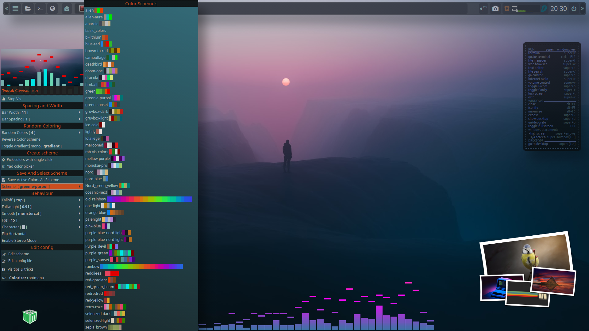
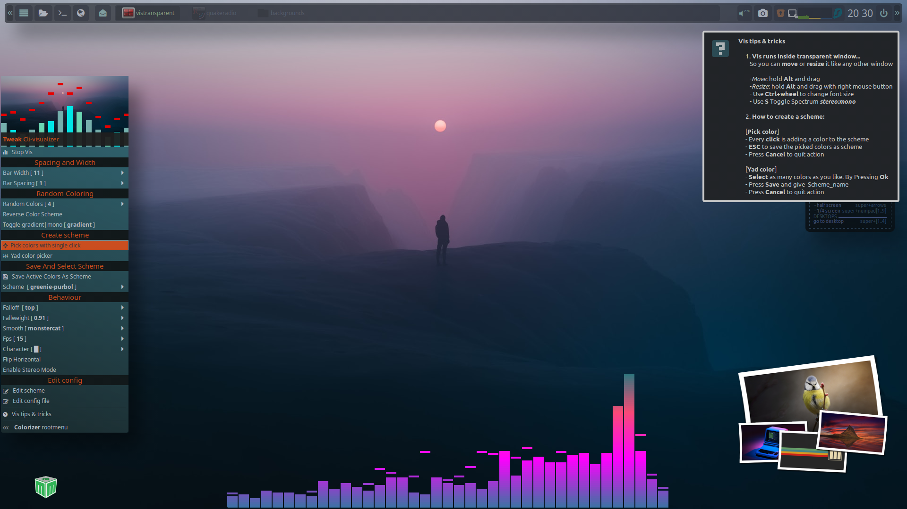
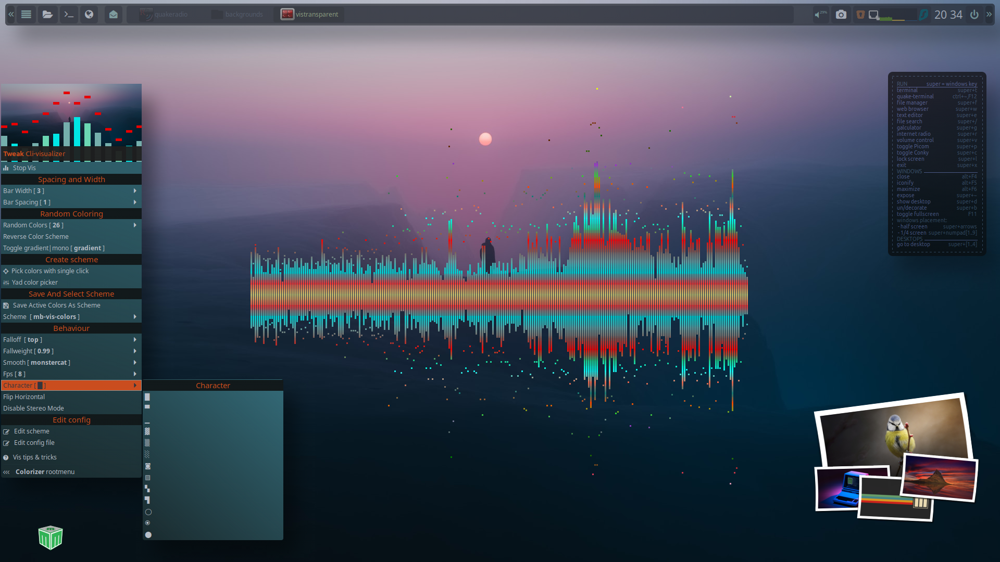
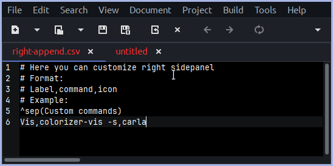

```

███╗   ███╗ █████╗ ██████╗  ██████╗ ██╗  ██╗
████╗ ████║██╔══██╗██╔══██╗██╔═══██╗╚██╗██╔╝
██╔████╔██║███████║██████╔╝██║   ██║ ╚███╔╝ 
██║╚██╔╝██║██╔══██║██╔══██╗██║   ██║ ██╔██╗ 
██║ ╚═╝ ██║██║  ██║██████╔╝╚██████╔╝██╔╝ ██╗
╚═╝     ╚═╝╚═╝  ╚═╝╚═════╝  ╚═════╝ ╚═╝  ╚═╝  Community: 
                                            
```
[@musqz mabox forum.](https://forum.maboxlinux.org/t/colorizer-vis-finally-control-audio-visualizer/1806)

# Menu for Cli-visualizer.(vis) 
### Fork colorizer-cava. Mabox originals.

### Features:

    Adjust visualizer settings on-the-fly.

    Easily integrate with Mabox's jgmenu.

    Only visualizer `Spectrum` supported.
  
    
Based on `colorizer-cava`, original work by @napcok. ([Mabox developer](https://github.com/Mabox-Linux))
    
#### Installation Cli-visualizer: DEPRICATED

		Install visualizer. [AUR](https://aur.archlinux.org/packages/cli-visualizer-git)

		```
		yay cli-visualizer-git
		``` 

**Use this fork instead:** https://github.com/musqz/cli-visualizer.git

### Installation colorizer-vis

Make scripts executable and copy to `~/bin` directory.

```
chmod +x bin/*
cp bin/* ~/bin
``` 


Copy config files to config directories. 

```
cp -rf .config/vis ~/.config 
cp .config/terminator/* ~/.config/terminator
``` 

Quick run:

```
colorizer-vis -s > /dev/null
```








---

**1. Running `vis` in terminator with transparent background:**

`transparent-vis`

**2. Right append _(example)_. Run colorizer-vis from right panel:**

`geany ~/.config/mabox/right-append.csv`

Add line:

    Visualizer tweaks (vis),colorizer-vis -s,carla




    
**3. RC Openbox Hotkey Config _(example)_:**

`transparent-vis` (full | half)_width_ (500 | 200 )_height_

```
<keybind key="C-A-v"><action name="Execute"><execute>transparent-vis full 300</execute></action></keybind>
```

`colorizer-vis -s`

```
<keybind key="W-A-v"><action name="Execute"><execute>colorizer-vis -s</execute></action></keybind>
```


**4. Compositor:**
    
Picom rules use: 
```
match = "name = 'vistransparent'";
```

---


**5. Note:** Jgmenu `Colorizer-vis` placement on the screen can be changed at the top of the script.

*Edit this line with `right` , ` left` or `center`. To set position of the menu on the screen.*

```
menu_halign="center"
```


